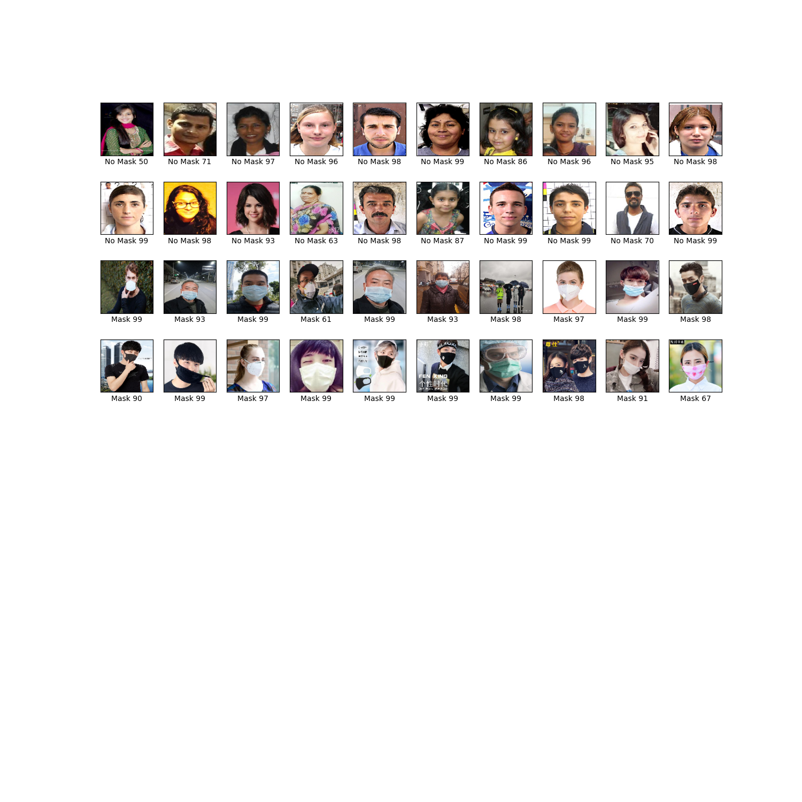

# Mask Detector
이미지와 영상 속에서 사람 얼굴을 찾은 뒤 마스크 착용 여부를 판단해주는 기능을 제공합니다.


## Installation

패키지 매니저 [pip](https://pip.pypa.io/en/stable/) 를 이용해서 설치합니다.

```bash
pip install -r requirements.txt
```

## Usage
### 학습된 모델  사용하기
```python
import os
import numpy as np
from model.hkmodel import SimpleCNNModel, preprocess_img

# X는 [size, 128, 128, 3] shape인 numpy array 입니다.
# 폴더에서 이미지를 불러와서 preprocess_img 함수를 이용해 (128, 128, 3) 형태로 변경합니다.
paths = [os.path.join(img_test_dir, x) for x in sorted(os.listdir(img_test_dir))]
X = [preprocess_img(path, 128) for path in paths]
X = np.array(X) # numpy 배열로 변경

# 모델을 불러와서 사용합니다.
model = SimpleCNNModel()
model.load_weights("simple.h5")

predictions = model.predict(X)
```

## Training
#### 1. 학습 데이터 추가
train/with_mask/ 폴더에는 마스크를 착용한 얼굴 사진을<br/>
train/without_mask/ 폴더에는 마스크를 착용하지 않은 얼굴 사진을 추가합니다.
#### 2. 학습
```python
> python train.py
Epoch 1/5
65/65 [==============================] - 26s 392ms/step - loss: 0.3580 - accuracy: 0.8483 - val_loss: 0.1343 - val_accuracy: 0.9652
Epoch 2/5
65/65 [==============================] - 25s 388ms/step - loss: 0.1823 - accuracy: 0.9391 - val_loss: 0.1002 - val_accuracy: 0.9783
Epoch 3/5
65/65 [==============================] - 26s 405ms/step - loss: 0.1886 - accuracy: 0.9377 - val_loss: 0.1252 - val_accuracy: 0.9522
Epoch 4/5
65/65 [==============================] - 25s 379ms/step - loss: 0.1460 - accuracy: 0.9483 - val_loss: 0.1308 - val_accuracy: 0.9565
Epoch 5/5
65/65 [==============================] - 25s 383ms/step - loss: 0.1235 - accuracy: 0.9609 - val_loss: 0.1250 - val_accuracy: 0.9609
```
학습된 모델을 model.h5에 저장합니다.

Weight & Biases Logging 를 사용하려면 `wandb login`을 통해 Wandb 계정을 생성합니다.<br/>
사용하지 않으려면 `wandb offline`을 실행해서 wandb를 비활성화합니다.<br/>
자세한 내용은 https://docs.wandb.ai/ 를 참고하세요


#### 3. 결과 테스트
```python
python test.py
```
테스트 결과가 test.png 파일로 저장됩니다.<br/>


### TODO
- License
- Team 소개