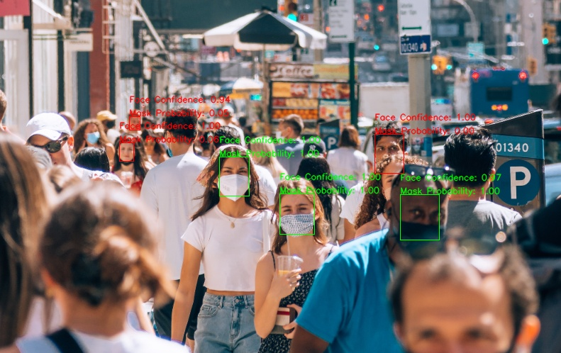
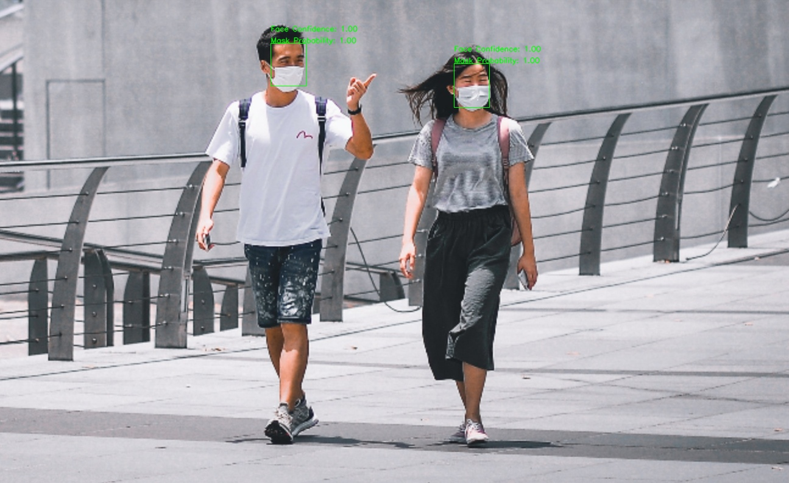
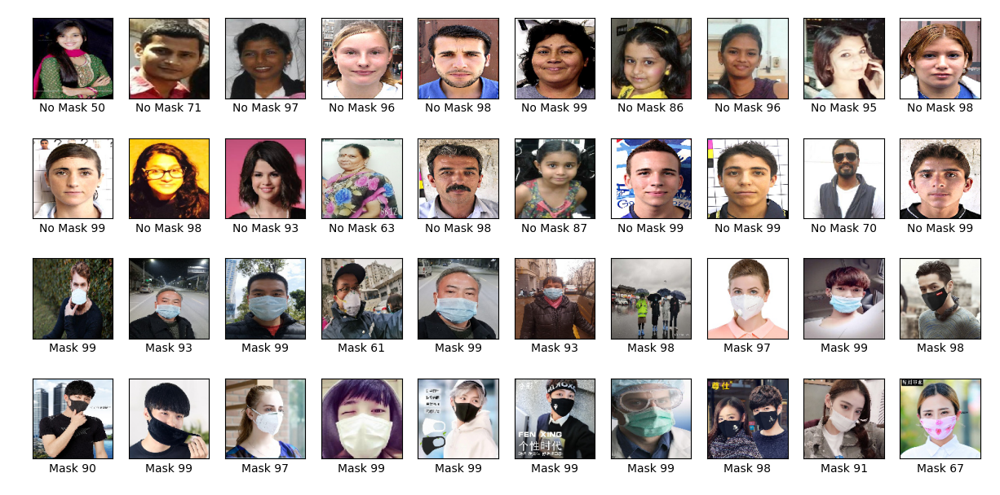

# Mask Detector
이미지와 영상 속에서 사람 얼굴을 찾은 뒤 마스크 착용 여부를 판단해주는 기능을 제공합니다.<br/>

<br/>
cottonbro님의 동영상, 출처: Pexels<br/>

Developed by [김영수(Young-Soo-Kim)](https://github.com/Young-Soo-Kim), [김희규(HeegyuKim)](https://github.com/HeegyuKim)

## Installation
먼저 저장소를 clone 한 뒤, 패키지 매니저 [pip](https://pip.pypa.io/en/stable/) 를 이용해서 필요한 라이브러리를 설치합니다.

```bash
git clone https://github.com/osamhack2021/AI_MaskDetector_Kitty.git
cd AI_MaskDetector_Kitty
pip install -r requirements.txt
```

## Usage
### 사진에서 마스크를 쓴 얼굴을 찾기
전체 예제는 [예제](examples/detect_image_masked_face.py)를 참고하세요.
1. 분석할 이미지를 로드합니다
```python3
import cv2
image_path = "./resource/sample/image/pexels-gustavo-fring-4127449.jpg"
image = cv2.imread(image_path)
image = cv2.cvtColor(image, cv2.COLOR_BGR2RGB)
```
2. FacenetDetector 혹은 OpenCVFaceDetector를 이용해서 이미지에서 얼굴을 찾습니다
```python3
from mask_detector import FacenetDetector, OpenCVFaceDetector
face_detector = FacenetDetector()
# face_detector = OpenCVFaceDetector()

faces, confidences, boxes = face_detector.detect_faces(image)
```
3. MaskDetector를 이용해서 찾은 얼굴 이미지가 마스크를 썼는지 판별합니다.
```python3
from mask_detector import MaskDetector
mask_detector = MaskDetector()
mask_probs = mask_detector.predict(faces)

print("마스크 쓴 확률", mask_probs) 
> 마스크 쓴 확률 [0.99954575 0.99999905 0.9970963  0.9999945 ]
```
4. 마스크 쓴 확률이 0.5 이상일 경우 마스크를 쓰지 않았다고 가정하고 마스크를 쓴 사람이 몇명인지 판단합니다.
```python3
mask_count = sum(1 for p in mask_probs if p >= 0.5)
print("마스크 쓴 사람은 총 {}명입니다.".format(mask_count))
> 마스크 쓴 사람은 총 4명입니다
```

### MaskedFaceDrawer를 이용하여 사진에서 마스크 쓴 영역에 그림그리기
```python3
from mask_detector import MaskedFaceDrawer
mask_drawer = MaskedFaceDrawer(mask_detector, face_detector)

mask_drawer.rectangle_faces(image)
```
MaskedFaceDrawer는 마스크를 썼다고 판단되는 얼굴 영역에는 초록 사각형을 그리며, 쓰지 않았다고 판단되는 얼굴 영역에는 붉은 사각형을 그립니다. 얼굴 위에는 얼굴 확신도와 마스크 착용 확률을 표시합니다.

#### 결과물 예시
<br/>
Photo by <a href="https://unsplash.com/@yoavaziz?utm_source=unsplash&utm_medium=referral&utm_content=creditCopyText">Yoav Aziz</a> on <a href="https://unsplash.com/@yoavaziz?utm_source=unsplash&utm_medium=referral&utm_content=creditCopyText">Unsplash</a><br/>
<br/>
Photo by <a href="https://unsplash.com/@victorhwn725?utm_source=unsplash&utm_medium=referral&utm_content=creditCopyText">Victor He</a> on <a href="https://unsplash.com/s/photos/mask?utm_source=unsplash&utm_medium=referral&utm_content=creditCopyText">Unsplash</a><br/>
  
### [detect_image.py](detect_image.py)를 사용하기
파이썬 코드를 사용하지 않고 커맨드 명령을 이용해 기능을 활용해보는 방법도 있습니다.
```
# 파일 하나를 분석해서 저장함.
> python3 detect_image.py image.jpg image-detected.jpg

# images/ 폴더에 있는 파일들의 분석결과가 images-detected/ 에 저장됩니다
> python3 detect_image.py images/ images-detected/

# detector에 opencv를 쓰고싶다면
> python3 detect_image.py images/ images-detected/ --detector=opencv
```

## 동영상에서 마스크 쓴 얼굴을 찾아보기
1. OpenCV를 이용하여 동영상 혹은 카메라에서 불러올 준비를 합니다.
```python3
import cv2

in_cap = cv2.VideoCapture(0) # 카메라에서 불러온다면
# in_cap = cv2.VideoCapture("movie.mp4") # 파일에서 불러온다면

if not in_cap.isOpened(): 
    print(f"파일을 열 수 없습니다: {input_file}")
    exit(0)
```
2. 분석에 필요한 MaskDetector와 FacenetDetector를 생성합니다.
```python3
from mask_detector import FacenetDetector, MaskDetector
mask_detector = MaskDetector()
face_detector = FacenetDetector()
```
3. 프레임을 읽어와서 이미지를 분석할 때와 동일하게 사용합니다.
```python3
ret, frame = in_cap.read()
if ret:
    image = cv2.cvtColor(frame, cv2.COLOR_BGR2RGB)
    faces, confidences, boxes = face_detector.detect_faces(image)
    mask_probs = mask_detector.predict(faces)
```

### 영상에 마스크 쓴 사람과 안쓴 사람을 찾아 표시하고 저장하기

OpenCV와 MaskedFaceDrawer를 활용한다면 가능합니다. [동영상에서 마스크 쓴 얼굴을 찾아서 표시하고 저장하는 예제](examples/detect_video_masked_face.py)를 참고하여 직접 결과물을 만들거나, detect_video.py를 이용하여 기능을 확인할 수 있습니다.<br/><br/>

```
# video.mp4를 읽어서 분석 후 결과를 video-detected.mp4에 저장합니다.
> python3 detect_video.py video.mp4 video-detected.mp4

# videos/ 폴더에 있는 파일들의 분석결과가 videos-detected/ 에 저장됩니다
> python3 detect_video.py videos/ videos-detected/

# detector에 opencv를 쓰고싶다면
> python3 detect_video.py videos/ videos-detected/ --detector=opencv
```
#### 결과물 예시
<br/>
George Morina님의 동영상, 출처: Pexels<br/>
<br/>
Everett Bumstead님의 동영상, 출처: Pexels<br/>

## GUI 데모 실행하기
카메라 혹은 동영상 파일을 선택하여 기능을 사용해볼 수 있는 GUI 데모가 포함되어있습니다. 아래 코드를 통해 실행해볼 수 있습니다.
```bash
# GUI 데모를 실행하기 위한 라이브러리를 설치한 이후에 실행해야합니다.
> pip install -r requirements_demo.txt
> python mask_detector_gui.py
```
## Training
#### 1. 학습 데이터 추가
train/with_mask/ 폴더에는 마스크를 착용한 얼굴 사진을<br/>
train/without_mask/ 폴더에는 마스크를 착용하지 않은 얼굴 사진을 추가합니다.
#### 2. 학습
```python
> python train.py
Epoch 1/5
65/65 [==============================] - 26s 392ms/step - loss: 0.3580 - accuracy: 0.8483 - val_loss: 0.1343 - val_accuracy: 0.9652
Epoch 2/5
65/65 [==============================] - 25s 388ms/step - loss: 0.1823 - accuracy: 0.9391 - val_loss: 0.1002 - val_accuracy: 0.9783
Epoch 3/5
65/65 [==============================] - 26s 405ms/step - loss: 0.1886 - accuracy: 0.9377 - val_loss: 0.1252 - val_accuracy: 0.9522
Epoch 4/5
65/65 [==============================] - 25s 379ms/step - loss: 0.1460 - accuracy: 0.9483 - val_loss: 0.1308 - val_accuracy: 0.9565
Epoch 5/5
65/65 [==============================] - 25s 383ms/step - loss: 0.1235 - accuracy: 0.9609 - val_loss: 0.1250 - val_accuracy: 0.9609
```
학습된 모델을 model.h5에 저장합니다.

Weight & Biases Logging 를 사용하려면 `wandb login`을 통해 Wandb 계정을 생성합니다.<br/>
사용하지 않으려면 `wandb offline`을 실행해서 wandb를 비활성화합니다.<br/>
자세한 내용은 https://docs.wandb.ai/ 를 참고하세요


#### 3. 결과 테스트
```python
python test.py
```
테스트 결과가 test.png 파일로 저장됩니다.<br/>



## Datasets
- LFW Face Database: http://vis-www.cs.umass.edu/lfw/
- Real-World Masked Face Dataset，RMFD: https://github.com/X-zhangyang/Real-World-Masked-Face-Dataset